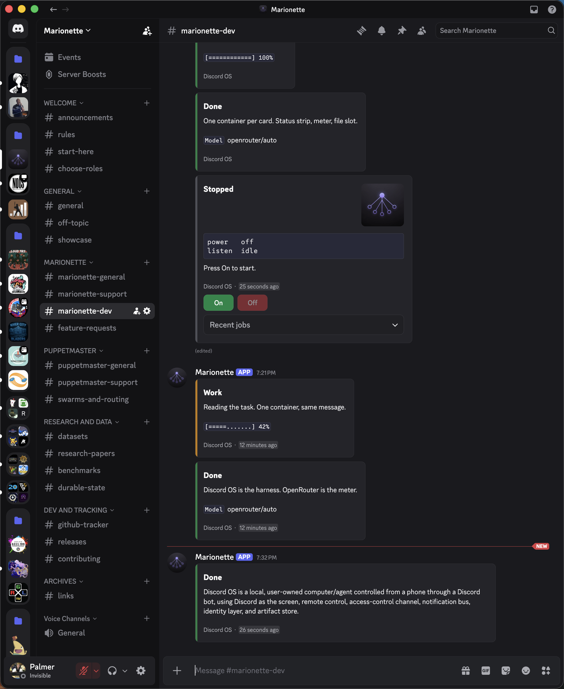

# Discord OS

Discord is the screen. This process is the computer. Your phone is the remote.

This is **your** bot on **your** machine. There is no hosted fleet to invite. Leave the host running; turn work on and off from Discord.

The GitHub repo is [`professorpalmer/agent-discord`](https://github.com/professorpalmer/agent-discord). The `agent-discord` command still works. Env vars and the `.agent-discord` workspace directory stay as they are.

## 1. Make a Discord bot

Do this once in a browser.

1. Open the [Discord Developer Portal](https://discord.com/developers/applications) and sign in.
2. **New Application**. Name it whatever you want (this is the bot people will see).
3. Left sidebar → **Bot**.
4. **Reset Token** / **Copy**. The token looks like `xxx.yyy.zzz`. That is `DISCORD_BOT_TOKEN`.
   - Do **not** use Application ID.
   - Do **not** use the OAuth client secret.
5. On the same Bot page, enable **Message Content Intent**. Save changes.
6. Left sidebar → **General Information**. Copy **Application ID** (digits only). That is `DISCORD_APPLICATION_ID`.
7. In Discord, create or pick a private staff channel. Copy its channel ID (Developer Mode → right-click the channel → Copy Channel ID).

## 2. Install once on the machine that will do the work

Python 3.11+. From a clone of `dev` today (`pip install discord-os` after PyPI):

```bash
python3 -m venv .venv
source .venv/bin/activate          # Windows: .venv\Scripts\activate
pip install -e .
pip install puppetmaster-ai        # compute kernel; not bundled
export OPENROUTER_API_KEY=...      # never commit
discord-os bootstrap
```

Put these in `.env` (or write the bot token to `~/.pmharness/.discord_token`, mode 0600):

```bash
DISCORD_BOT_TOKEN=xxx.yyy.zzz
DISCORD_APPLICATION_ID=123456789012345678
```

Then one command:

```bash
discord-os setup --channel-id YOUR_CHANNEL_ID
```

That invites the bot (open the printed URL), installs a login helper so it comes back after reboot, and posts a HOST card in the channel with **On**, **Off**, and **Ask**. You do not type commands in Discord after this.

## 3. Use it from Discord

| In Discord | What happens |
|---|---|
| **On** | Starts work on the host. Type a normal sentence as a task. |
| **Ask** | Opens a prompt. Questions stay read-only. File work still edits. |
| **Off** then **Confirm** | Stops work. Cancel keeps it running. The helper stays so On still works from your phone. |
| Recent jobs | String select on the HOST card. Pick a run to see its receipt. |
| a normal sentence | A task, only while On. Progress starts a thread; the receipt stays in that thread. |

If Discord logs the bot out, work stops. The login helper starts again idle.

No Docker. No slash commands. No public URL. No `/on` to remember.

Default I/O is Discord REST. SaseQ/BrainDAO MCP is optional if you already run those servers.

## Thesis

Discord already is the phone UI, the ACL (a channel you control), the notification bus, and the identity layer. Discord OS treats **artifacts as Discord objects**:

```text
object bytes
  → attachment + caption on a channel message
  → Discord CDN (ephemeral signed URL, ~24h)
  → durable key = channel_id / message_id / attachment_id (+ sha256)
  → retrieve later by re-fetching the message (fresh URL), then downloading
```

Never persist a CDN URL as the durable key. Official retrieve is Get Channel Message (or `POST /attachments/refresh-urls`). Jump links (`https://discord.com/channels/{guild|@me}/{channel}/{message}`) are what we print for humans.

## Prior art (steal economics, not product)

Two piles exist. We are neither.

| Pile | Examples | What they do | What we take | What we refuse |
|------|----------|--------------|--------------|----------------|
| Discord-as-disk | DiscordFS, forscht/ddrive, KITdt/discord-drive, missuo/discord-image | Chunk files into channels as free S3 / WebDav | Snowflake ID pointer; refresh-on-get | Unlimited chunked S3, public CDN, WebDav, 4TB multipart |
| Discord-as-agent-relay | Discode, Agent4Discord, Agentboard, cursor-mobile-bridge, claudecode-discord | Channel=workspace, thread=run, phone UI; artifacts stay on local disk/tmux | Channel as workspace / ACL; phone-native receipts | Relaying progress while leaving blobs on disk only |

Discord has said: if you host files on Discord, find a more suitable service. Honest S3 replacement here means **agent artifacts under Discord size limits in your own staff channel**. It does not mean a public CDN.

Default live I/O is **Discord REST** with the Bot token (`DISCORD_BOT_TOKEN` or `~/.pmharness/.discord_token`). That value is the Bot token (`xxx.yyy.zzz`) from the Bot tab — not the Application client ID and not the OAuth client secret. Optional SaseQ/BrainDAO MCP adapters try file-tool names first; if the catalog has no file tool they fall back to the same REST path. We still refuse to base64-dump files into `send_message`. The fake provider is the hermetic proof of the protocol. Foreground `listen` does **not** open a Discord Gateway. `host` / `setup` opens a Gateway **only** so On/Off buttons work — no public URL. Do not run that beside another bot process that already owns the Gateway.

## Honest limits

- Default object cap is **10 MiB** (`DISCORD_MAX_OBJECT_BYTES=10485760`). Discord free is roughly 10–25MB; Nitro is higher. Configurable, not unlimited.
- Discord ToS: conversation artifacts in **your** server, not a public CDN or anonymous disk.
- Not a compute host. Default compute is `AGENT_DISCORD_COMPUTE=auto`: Puppetmaster **agentic** (`openrouter/auto`) when an OpenRouter key is on the host or in the workspace vault; otherwise the Cursor pin (`cursor/grok-4-5` / adapter `grok-4.5`). **No silent model fallback.**
- No DiscordFS-style multipart chunking. Oversize artifacts become an `overflow` pointer + local stash, not multipart CDN objects.
- `/connect <secret>` and `/open` are message-prefix verbs by default, not Discord slash Interactions. Discord still sees shred payloads once before delete.
- `listen` ignores channel history older than a durable per-channel SQLite watermark (first listen: now minus 15s, same slack as process start; later processes resume from the stored high-water, including skipped cards/connects/opens) so a seeded staff channel is not dispatched as an implement job.

## What a run does

1. **Connect** (optional): `/connect` on the listen host inherits `OPENROUTER_API_KEY`, shreds a pasted secret after delete, or mints a pairing ticket for `discord-os connect --ticket`.
2. **Intake** a natural-language task from `run` or the host loop (staff channel / phone). Cards, receipts, and object-store captions are skipped. On/Off buttons, `/connect`, and `/open` are intercepted before task dispatch. Work is accepted only while On. Discord is the remote; this process opens Terminal, the file manager, or an allowlisted browser on the host.
3. **Snapshot** scoped context from SQLite memory + channel bindings.
4. **Dispatch** to Puppetmaster agentic (OpenRouter/BYOK) or the Cursor pin, depending on resolved compute.
5. **Persist** events, then **put** backend file artifacts through the object store (overflow pointer + stash when over the cap). Local path is kept if put fails.
6. **Relay** Discord-safe `**Card**` progress (edited in place when possible) and a receipt that shows kind + jump URL (never a CDN URL, never hidden chain-of-thought).

## Optional MCP Discord servers

Default I/O is REST. These adapters are optional. **Upstream source code is not copied.**

| Provider | Repository | License | Notes |
|----------|------------|---------|-------|
| **SaseQ / discord-mcp** | https://github.com/SaseQ/discord-mcp | MIT | HTTP endpoint convention via `SASEQ_MCP_HTTP_URL` (default `http://127.0.0.1:8085/mcp`). Prefer HTTP; stdio requires an explicit `DISCORD_MCP_STDIO_COMMAND` (no fabricated npm default). |
| **BrainDAO / mcp-discord** (`@iqai`) | https://github.com/BrainDAO/mcp-discord | MIT | Sampling/tool convention exposed as an adapter seam; **one Gateway owner per bot token** — no second Gateway required. Stdio requires an explicit `DISCORD_MCP_STDIO_COMMAND` such as `npx -y @iqai/mcp-discord`. |

See [`THIRD_PARTY_NOTICES.md`](THIRD_PARTY_NOTICES.md) for details.

## Dev / fake path

```bash
# Requires Python 3.11+
python -m venv .venv
source .venv/bin/activate
pip install -e ".[dev]"

cp .env.example .env
# DISCORD_BOT_TOKEN = Bot token (xxx.yyy.zzz), never Application ID or OAuth secret

discord-os bootstrap
discord-os check

# Dry-run (fake Discord + fake Puppetmaster — no network)
discord-os run "Summarize open items" --channel-id 123 --fake --no-discord-post
discord-os put ./notes.bin --channel-id 123 --fake --json
discord-os get MESSAGE_ID --channel-id 123 --out ./got.bin --fake --json
discord-os listen --channel-id 123 --fake --once
discord-os connect --provider openrouter --from-env --json
discord-os status --json
```

### Discord providers

- Default: `DISCORD_MCP_PROVIDER=rest` (official API, no MCP process)
- Optional: `saseq` or `braindao` plus `DISCORD_MCP_TRANSPORT=http` or `stdio`
- HTTP URLs: `SASEQ_MCP_HTTP_URL` (default `http://127.0.0.1:8085/mcp`) / `BRAINDAO_MCP_HTTP_URL`
- Stdio: `DISCORD_MCP_STDIO_COMMAND` is **required** when `transport=stdio`
- `DISCORD_MAX_OBJECT_BYTES` (optional; default `10485760`)

MCP catalog discovery is runtime-only. Missing file tools fall back to REST. CDN URLs stay ephemeral.

### Compute and keys

| Path | How the key arrives | What Discord sees |
|------|---------------------|-------------------|
| Host inherit | `OPENROUTER_API_KEY` already on the listen host; `/connect` or `connect --from-env` | Fingerprint only |
| Pairing ticket | `/connect` with no secret mints an 8-char ticket (15 min); paste the key on host stdin | Ticket code only |
| Shred absorb | `/connect <secret>` or `!connect <secret>` | Payload once, then delete; card is fingerprint only |

Vault files live under `{workspace}/keys/` (ciphertext + `master.key`). Never commit them. Agentic dispatch injects the key into the **subprocess env** as `OPENROUTER_API_KEY` — never argv, never logs.

### Host surfaces (poverty default)

Discord is the remote. The listen host opens local surfaces the same way a desktop harness does:

| Verb | What opens |
|------|------------|
| `/open` or `!open` (default: files) | File manager at the workspace-relative path |
| `/open terminal [path]` | Terminal at that path |
| `/open files [path]` | File manager |
| `/open browser <url>` or `/open https://…` | Browser, allowlisted only |

Paths stay inside `PUPPETMASTER_CWD` and the workspace. `~` is rejected. Browser URLs are loopback `http(s)` to `127.0.0.1` or `localhost`, or Discord channel jump links (`https://discord.com/channels/…`). Same engine: `discord-os open terminal|files|browser`.

Slash chrome is **opt-in** and does not replace `listen`. Set `AGENT_DISCORD_INTERACTIONS=http`, install `pip install 'discord-os[interactions]'` for Ed25519 verify, then `discord-os interactions --register --guild-id ID` and `--serve`. Bind is loopback (`127.0.0.1:8743`). If you want Discord to POST Interactions, you tunnel that URL and paste **your** public HTTPS URL into Developer Portal → Interactions Endpoint URL. Do not paste a tunnel URL into chat. Slash `/connect` has **no secret option** — inherit, ticket, or host CLI only. This does not open a second Gateway.

### Puppetmaster model pin

| Field | Value |
|-------|-------|
| Compute default | `AGENT_DISCORD_COMPUTE=auto` |
| Agentic canonical / adapter | `openrouter/auto` |
| Canonical Cursor model (receipts/audit) | `cursor/grok-4-5` |
| Cursor adapter (`puppetmaster cursor --model`) | `grok-4.5` |
| Cursor allowlist | **only** `cursor/grok-4-5` |
| Agentic allowlist | **only** `openrouter/auto` |

Requests for any other model raise an error. There is **no** silent remap. Cursor compute still invokes `puppetmaster cursor …`. Agentic compute invokes `puppetmaster agentic … --provider openrouter --mode analyze` for questions, or `--mode implement --allow-dirty` for file work. Set `PUPPETMASTER_CWD` to control `--cwd`.

### Bot look

Developer Portal → Bot can set avatar and banner. If the bot has no avatar, `discord-os host start` uploads a local gold-bar mark once. Do not run SaseQ `discord-mcp` beside this host — one bot, one Gateway.

### Screenshots



The mark used when the bot has no avatar:


Cards live in your staff channel. After setup, the HOST card is the dashboard: On / Off / Ask, a recent-jobs menu, and the bot thumbnail. Each task opens a thread.

### Optional Marionette backend

Default `AGENT_DISCORD_BACKEND=puppetmaster`. To opt in:

```bash
AGENT_DISCORD_BACKEND=marionette
MARIONETTE_BASE_URL=http://127.0.0.1:8787   # your local Marionette HTTP API
# Optional path overrides (defaults shown):
# MARIONETTE_SESSIONS_PATH=/v1/sessions
# MARIONETTE_JOBS_PATH=/v1/jobs
```

The adapter documents an expected session/job/events/status/cancel contract; it does **not** pretend an unverified endpoint is guaranteed. Missing `MARIONETTE_BASE_URL` or transport failures surface as configuration/transport errors.

## CLI

```text
discord-os bootstrap [--workspace PATH]
discord-os check [--allow-empty-token] [--live] [--channel-id ID]
discord-os run TASK --channel-id ID [--message-id ID] [--fake] [--no-discord-post] [--json]
discord-os setup --channel-id ID
discord-os host start --channel-id ID
discord-os host stop
discord-os host status
discord-os listen --channel-id ID [--once] [--interval SEC] [--fake] [--json]
discord-os connect [--provider openrouter] [--ticket T] [--from-env] [--json]
discord-os status [--json]
discord-os invite [--application-id ID] [--json]
discord-os open {terminal,files,browser} [PATH_OR_URL] [--json]
discord-os interactions [--register] [--guild-id ID] [--serve] [--json]
discord-os put PATH --channel-id ID [--thread-id ID] [--guild-id ID] [--kind blob] [--fake] [--json]
discord-os get MESSAGE_ID --channel-id ID [--attachment-id ID] [--out PATH] [--fake] [--json]
discord-os ls --channel-id ID [--run-id ID] [--fake] [--json]
```

`put` / `get` / `ls --fake` need no network. `get` writes bytes to `--out`, or to stdout only when stdout is not a tty (otherwise `--out` is required). Pointer JSON never includes a `url` key.

Also: `python -m agent_discord …`

## Architecture (small & readable)

```text
CLI → Orchestrator → backend (Puppetmaster agentic | Puppetmaster cursor | optional Marionette HTTP | fake)
                  ↘ SQLite (bindings, tasks, runs, events, memory, artifacts + object pointers,
                            inbound message dedupe, gateway ownership,
                            optional research claims / leases / negatives)
                  ↘ Discord facade → object store → REST (default) | optional SaseQ/BrainDAO | fake
```

Message intake is REST. The host process opens a Discord Gateway only for On/Off buttons. The SQLite gateway row is a local one-process lock and is stolen if the previous owner pid is dead.

- **stdlib-first** core; optional `pytest` for development.
- Explicit typed contracts + dependency injection — tests never need Discord, Cursor, or network.
- Durable object key is `DiscordObjectRef` (channel / message / attachment / sha256). Channel id is the ACL; `get` refuses a mismatched caller channel (confused-deputy).
- Gateway exclusivity is **durable** in SQLite across concurrent local processes (in-memory registry retained for unit tests).
- Inbound Discord message IDs are deduplicated at orchestration level (prior receipt reused or explicit ignored-duplicate result).
- Event/artifact payloads recursively strip forbidden hidden-reasoning keys.
- BrainDAO sampling-compatible ingress is an adapter seam on the same facade.
- **Research memory** (optional orchestration context): typed claims with deterministic fingerprints, atomic leases, provenance/evidence, and queryable negative findings. Ordinary memory recall is unchanged; research metadata is not required for normal tasks.
- **Marionette backend** (optional, explicit opt-in via `AGENT_DISCORD_BACKEND=marionette`): stdlib urllib adapter with configurable endpoint paths and injectable transport for tests. Default remains Puppetmaster. Unconfigured/unavailable Marionette fails closed — no silent fallback. Model field still carries the canonical pin `cursor/grok-4-5` → adapter `grok-4.5`.

## Development / tests

```bash
pip install -e ".[dev]"
pytest
```

Tests use fake MCP, Puppetmaster, and Marionette providers only.

## License

MIT — see [`LICENSE`](LICENSE).
