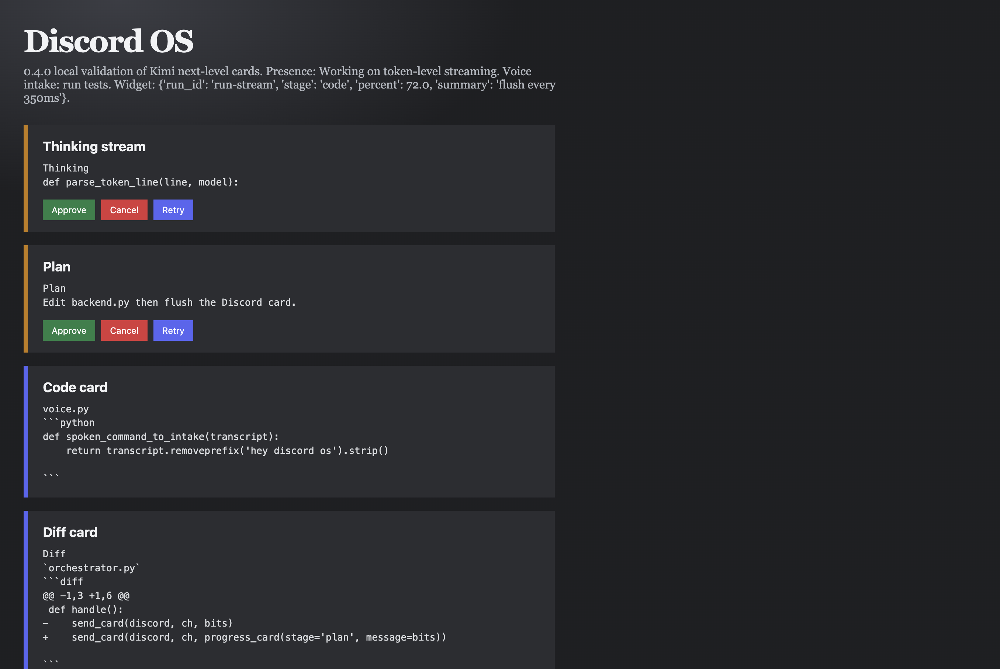

# Cards

One live card per job. That card lives in the **job thread**, not the channel.

The moment an ask lands, Discord OS opens a thread on the user message and posts "On it." Then the worker starts. The channel stays free.

Token flushes edit that same card. When the beat changes (or the job hits Done / Failed), the previous user-facing text is persisted as a normal thread message first (Hermes persist-then-settle). History survives edits. Do not settle "On it." / "Starting." / empty / percent-only / prompt-echo / host-reach dumps. Do not spam a new message per token.

Done is the actual user answer. Worker monologue ("Let me write the Discord answer", `report:`, host-reach dumps) never reaches Discord.

Harness cards (`**Card**`, `**Receipt**`, HOST, NOTE) are skipped on intake so the bot does not dispatch itself. HOST stays the settings analog — do not dump metrics into job cards.

A follow-up in the job thread stays there (steer). Do not start a nested thread.

## Code

- `src/agent_discord/orchestration/cards.py` — builders, skip rules
- `src/agent_discord/orchestration/orchestrator.py` — reply-first thread, one live card, persist-then-settle
- Tests: `tests/test_cards.py`, `tests/test_orchestration.py`
